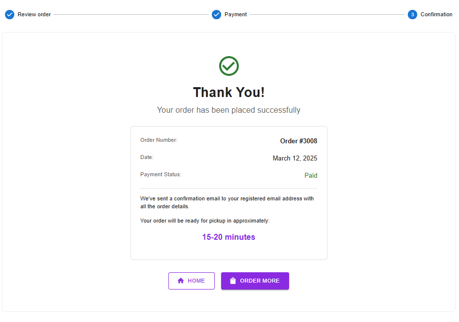

# User/Testing Documentation

## Route: GET all users
**URL**:  
`http://localhost:5000/users/all`

**Screenshot**:  


---

## Middleware to Protect the Route and Its Purpose:

### `checkUserFirebaseUid`

**Purpose**:  
Validates the Firebase UID extracted from the `Authorization` header (Bearer token). If no token is provided, the request is treated as from a guest.

**Usage**:  
```js
app.use(checkUserFirebaseUid); // Authenticates user requests
```

### `checkAdminRole`

**Purpose**:  
Checks if the authenticated user has admin privileges or is accessing their own data. If neither condition is met, the request is denied with a "Forbidden" response.

**Usage**:  
```js
app.use(checkAdminRole); // Protects routes that require admin or self-access permissions
```
## Route: GET user by ID (admin only)

**URL**:  
`http://localhost:5000/user/:id`

**Method**:  
`GET`

**Middleware**:  
- `checkUserFirebaseUid`: Validates the Firebase UID from the `Authorization` header (Bearer token).
- `checkAdminRole`: Ensures that the user has admin privileges or is accessing their own data.

**Purpose**:  
Fetches the user data for any user by their ID. This route can only be accessed by an admin or the user themselves.

**Screenshot**:  


## Route: POST register user

**URL**:  
`http://localhost:5000/register`

**Method**:  
`POST`

**Middleware**:  
- `validateRequiredFields`: Ensures that the `displayName` and `email` fields are provided in the request body.
- `checkDuplicateUser`: Checks if a user with the same email already exists.
- `checkUserFirebaseUid`: Validates the Firebase UID from the `Authorization` header (Bearer token).

**Purpose**:  
Registers a new user with a Firebase UID and other necessary details like `displayName`, `email`, `photoURL`, and `favorites`. The user role defaults to "user" if not provided.

**Screenshot**:  


## Route: GET all menu items

**URL**:  
`http://localhost:5000/menu`

**Method**:  
`GET`

**Purpose**:  
Fetches all menu items from the database.

**Screenshot**:  

.png)


## Route: POST create new menu item

**URL**:  
`http://localhost:5000/menu/new`

**Method**:  
`POST`

**Middleware**:  
- `validateRequiredFields`: Ensures that the `name`, `basePrice`, and `category` fields are provided in the request body.
- `validateToppings`: Validates that the provided toppings are valid.
- `validateCategory`: Validates that the provided category is valid.
- `checkUserFirebaseUid`: Validates the Firebase UID from the `Authorization` header (Bearer token).
- `checkAdminRole`: Ensures the user has admin privileges or is accessing their own data.

**Purpose**:  
Creates a new menu item with validated data (name, base price, category, etc.). The request must include valid category and topping data.

**Screenshot**:  


## E2E testing




## Route: GET authenticated user's orders

**URL**:  
`http://localhost:5000/orders/me`

**Method**:  
`GET`

**Purpose**:  
Fetches all orders associated with the authenticated user.

**Middleware**:  
- `checkUserFirebaseUid`: Validates the Firebase UID from the `Authorization` header (Bearer token).
- `checkUserId`: Validates the user through Firebase and attaches the `userId` to the request object (`req.userId`).

**Response**:  
- **Success (200)**: Returns the user's orders.
- **Error (401)**: Returns an error if the user is not authenticated or the Firebase UID is missing.

**Screenshot**:  


## Route: GET all toppings

**URL**:  
`http://localhost:5000/toppings`

**Method**:  
`GET`

**Purpose**:  
Fetches all available toppings from the database.

**Response**:  
- **Success (200)**: Returns a list of all toppings.

**Screenshot**:  


## Route: POST create payment intent

**URL**:  
`http://localhost:5000/payment`

**Method**:  
`POST`

**Purpose**:  
Creates a payment intent using Stripe to initiate the payment process.

**Response**:

**Success (200)**: Returns the clientSecret for the payment intent.

```json

{
  "clientSecret": "pi_1234_secret_5678"
}
```


## Route: POST store successful payment

**URL**:  
`http://localhost:5000/payment/store`

**Method**:  
`POST`

**Purpose**:  
Stores the successful payment information.


